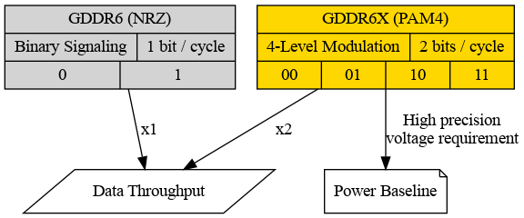
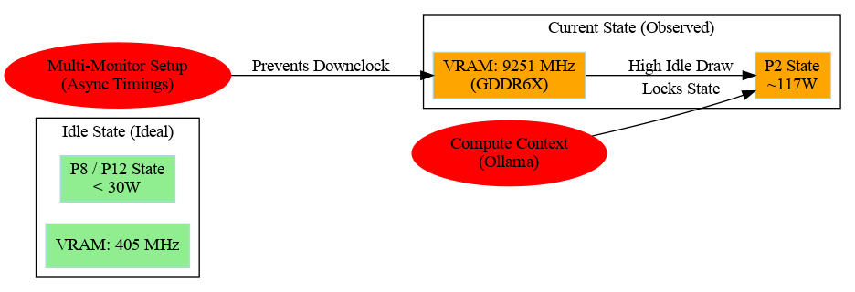
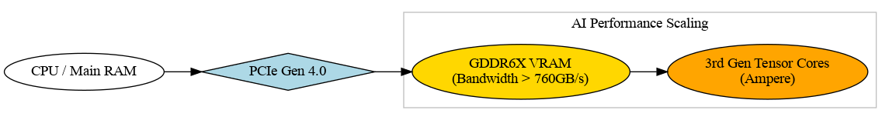
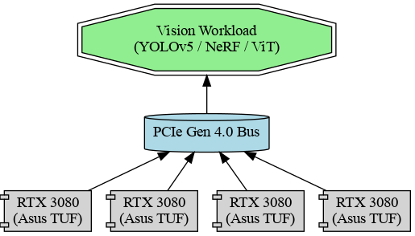
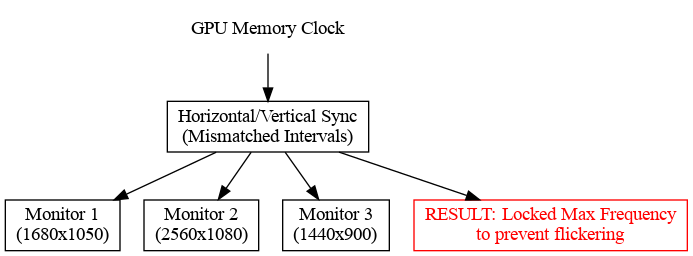

# Ampere Vision Archival
### RTX 3080 Technical Investigation & Historical AI Capabilities



## 📋 Project Overview
This repository contains a technical investigation into the NVIDIA Ampere architecture, specifically the **RTX 3080 (Asus TUF Gaming)**. It documents the "High Power Idle" phenomenon observed in multi-monitor and compute-active environments, and provides historical context for its role in AI and Computer Vision clusters circa 2020-2022.

## 🔍 Core Insights

### 1. GPU Power Dynamics
The RTX 3080 can pull >100W even at 0% core utilization. This is due to P-state locking from active CUDA contexts (like Ollama) and memory clock retention.



### 2. GDDR6X & PAM4 Signaling
The fundamental shift from GDDR6 to GDDR6X involved moving from binary NRZ signaling to 4-level Pulse Amplitude Modulation (PAM4). While this doubled bandwidth, it introduced a significant idle power baseline due to precision voltage requirements.


### 3. The "Memory Wall" & Tensor Cores
Ampere's 3rd Gen Tensor Cores require massive data throughput to remain saturated. GDDR6X provides the >760 GB/s bandwidth necessary to feed these execution units for high-resolution vision tasks.



### 4. Multi-GPU Vision Clusters (2020-2022)
A "battery" of Asus TUF 3080s formed the core of prosumer AI clusters. Leveraging PCIe Gen 4.0 and "Mil-Spec" cooling, these rigs were used for training YOLOv5, NeRF, and Vision Transformers.



### 5. Multi-Monitor Sync Constraints
Driving multiple displays with asynchronous timings prevents the memory from downclocking to save power, as frequency shifts during a refresh cycle would cause visible flickering.



## ⚡ Optimizations & Efficiency
A key finding of this investigation was the high idle power draw (~120W) of the RTX 3080 in multi-monitor setups. We implemented a "Clock Locking" strategy to resolve this.

**Detailed deep-dive available in: [/optimizations](/optimizations)**

### GPU Power Toggle Script
Included in this repo is `gpu_power_toggle.sh`, a utility to switch the RTX 3080 between two profiles:
- **ECO Mode (`./gpu_power_toggle.sh eco`):** ~44W Idle Power.
- **PERFORMANCE Mode (`./gpu_power_toggle.sh perf`):** Full 340W and Automatic management.

### Boot Persistence
To ensure these savings survive a reboot, we have implemented a systemd service:
- **Service File:** `gpu-eco-mode.service` (Included in root)
- **Deployment:**
  ```bash
  sudo cp gpu-eco-mode.service /etc/systemd/system/
  sudo systemctl daemon-reload
  sudo systemctl enable gpu-eco-mode.service
  ```

### 🐕 Automated Watchdog
For seamless management, we've included a watchdog daemon that toggles modes based on active load:
- **Service File:** `tools/gpu-watchdog.service`
- **Logic:** Switches to `perf` when CUDA/GPU utilization is detected; reverts to `eco` after 60s of idle.
- **Deployment:**
  ```bash
  sudo cp tools/gpu-watchdog.service /etc/systemd/system/
  sudo systemctl daemon-reload
  sudo systemctl enable --now gpu-watchdog.service
  ```

## 📊 Monitoring Dashboard
Included in `tools/gpu_dashboard.py` is a colorized CLI dashboard specifically tuned for dual-GPU (Ampere/Blackwell) setups, highlighting P-states and power transitions.

## 🛠 Technical Specifications (Asus TUF RTX 3080)
- **Architecture:** Ampere (GA102)
- **Memory:** 10GB/12GB GDDR6X
- **Bandwidth:** ~760 - 912 GB/s
- **Signaling:** PAM4
- **Build:** Military-Grade Capacitors, Dual Ball Fan Bearings, Aluminum Shroud

## 📄 License
MIT
